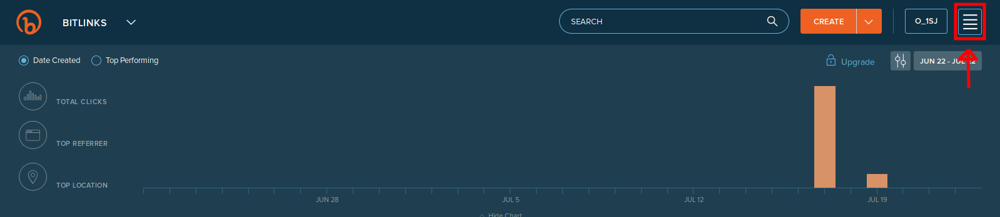
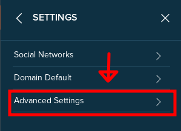
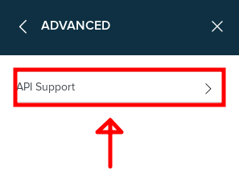
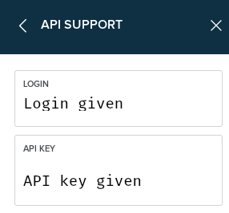

# Start the server
If it is your first use of this little 'backend', you first have to use the command `npm install` to install all the required packages to make this REST API work.

You can start the server by typing `node server.js`

# Use
There are actually two callable function for this REST API:

## Login
Fetch a loginToken from wikimedia commons API, logs in with credentials (You can add your own credentials in a bot.json file placed in the root folder) and fetch a CSRFToken used to, here, upload a picture to wikimedia commons

## Upload
Uploads the image, make the returned url pass through the bitly API to make it shorter and then returns it to your frontend

## The bot.json credentials file
In order to log in wikimedia and bitly you need credentials: for obvious security reasons, the original `bot.json` credentials file is not shared online. But you can create your own by registering an account at wikimedia and after create a bot password <a href="https://www.mediawiki.org/wiki/Special:BotPasswords">here</a>

You also need an account for shortening links through bit.ly API. You can create an account <a href="https://bitly.com/a/sign_in">here</a>. Steps to get the API credentials below.

Here is a template of the `bot.json` credentials file: 
```js
{
    "loginInfo": {
        "lgname": "<given wikimedia's bot login username>",
        "lgpassword": "<given wikimedia's bot password>"
    },
    "wikimedia": {
        "login": "<given bitly's login username>",
        "api_key": "<given bitly's password>"
    }
}
```

## How to get the Bitly's API credentials
Just follow the red arrows after creating your account and being on the bitly page.





