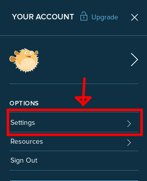

<p align="center"><h1>Open Heritage Map</h1></p>

<p align="center"></p>

<p align="center">With Open Heritage Map, you can preserve memories about objects or locations that no longer exists. Add or edit information about these memories, like a story or a photograph, on the geographical map and cherish them forever as historical data!</p>

# How to use this application

## Start the server
If it is your first use of this little 'backend', you first have to use the command `npm install` to install all the required packages to make this REST API work.

You can start the server by typing `node server.js`

## Use
There are actually two callable function for this REST API:

## Login
Fetch a loginToken from wikimedia commons API, logs in with credentials (You can add your own credentials in a bot.json file placed in the root folder) and fetch a CSRFToken used to, here, upload a picture to wikimedia commons

## Upload
Uploads the image, make the returned url pass through the bitly API to make it shorter and then returns it to your frontend
Actually the upload feature is unavailable, due to our testing, we have unfortunately been banned from wikimedia. If you use this backend to use the image feature, please make your own wikimedia account and then make your bot.json file with the template given below.

## The bot.json credentials file
In order to log in wikimedia and bitly you need credentials: for obvious security reasons, the original `bot.json` credentials file is not shared online. But you can create your own by registering an account at wikimedia and after create a bot password <a href="https://www.mediawiki.org/wiki/Special:BotPasswords">here</a>

You also need an account for shortening links through bit.ly API. You can create an account <a href="https://bitly.com/a/sign_in">here</a>. Steps to get the API credentials below.

Here is a template of the `bot.json` credentials file: 
```js
{
    "loginInfo": {
        "lgname": "<given wikimedia's bot login username>",
        "lgpassword": "<given wikimedia's bot password>"
    },
    "wikimedia": {
        "login": "<given bitly's login username>",
        "api_key": "<given bitly's password>"
    }
}
```

## How to get the Bitly's API credentials
Just follow the red arrows after creating your account and being on the bitly page.
<br>
<p>Go to your account settings</p>
<br>
<p>Click advanced settings</p>
<br>
<p>Click API Support</p>
<br>
<p>There are your credentials, you can copy/paste them into the bot.json file that you created based on the template given</p>
<br>
